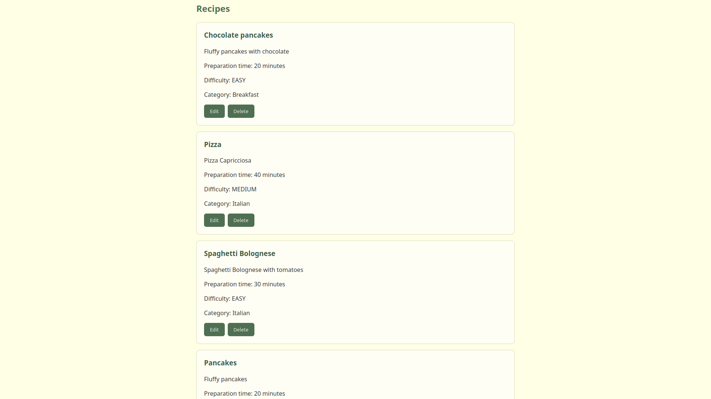
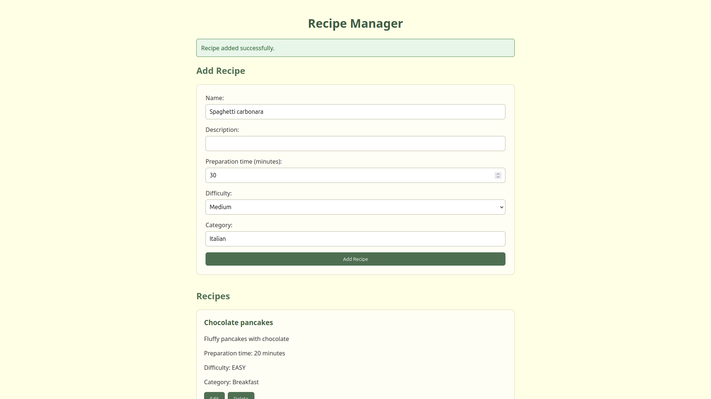

# Recipe Manager

A simple full-stack web application for managing recipes. The project was created to practice building a REST API with Java and Spring Boot and integrating it with an Angular frontend.

## Features

* Create new recipes
* Display a list of recipes
* Edit existing recipes
* Delete recipes
* Validate recipe data on both the frontend and backend
* Store recipe data in a persistent H2 database
* Display feedback after create, update, and delete operations

## Technologies

### Backend

* Java 21
* Spring Boot
* Spring Web
* Spring Data JPA
* Hibernate
* H2 Database
* Maven

### Frontend

* Angular
* TypeScript
* HTML
* CSS


## Architecture

The application consists of an Angular frontend and a Spring Boot backend.

```text
Angular frontend
       |
       | HTTP / JSON
       v
Spring Boot REST API
       |
       v
Spring Data JPA / Hibernate
       |
       v
H2 relational database
```

The frontend communicates with the backend through HTTP requests. The Spring Boot application exposes REST endpoints and uses Spring Data JPA to access the database.

## REST API

The backend provides the following endpoints:

| Method | Endpoint            | Description               |
| ------ | ------------------- | ------------------------- |
| GET    | `/api/recipes`      | Get all recipes           |
| GET    | `/api/recipes/{id}` | Get a recipe by ID        |
| POST   | `/api/recipes`      | Create a new recipe       |
| PUT    | `/api/recipes/{id}` | Update an existing recipe |
| DELETE | `/api/recipes/{id}` | Delete a recipe           |

## Recipe Model

A recipe contains:

* ID
* Name
* Description
* Preparation time
* Difficulty
* Category

Example:

```json
{
  "id": 1,
  "name": "Pancakes",
  "description": "Fluffy breakfast pancakes",
  "preparationTime": 20,
  "difficulty": "EASY",
  "category": "Breakfast"
}
```

## Validation

Recipe data is validated on both sides of the application.

The frontend prevents submitting a recipe without a name or with a preparation time shorter than one minute.

The backend also validates incoming requests before saving them to the database.

## Running the Application

### Backend

From the project directory:

```bash
cd backend
./mvnw spring-boot:run
```

The backend starts on port `8080`.

### Frontend

In another terminal:

```bash
cd frontend
npm install
npm start
```

The Angular development server starts on port `4200`.

Open the application in a browser at:

```text
http://localhost:4200
```

## Project Structure

```text
recipeapp/
├── backend/
│   └── Spring Boot REST API
├── frontend/
│   └── Angular application
└── README.md
```

## What I Practiced

While building this project, I practiced:

* developing REST APIs with Spring Boot
* working with Java and Spring Data JPA
* implementing CRUD operations
* working with a relational database
* validating API input
* building Angular components and services
* using TypeScript and Angular data binding
* communicating with a REST API using `HttpClient`
* handling asynchronous HTTP operations
* styling a web interface with CSS
* using Git for version control


## Screenshots

### Recipe List



### Adding a Recipe

